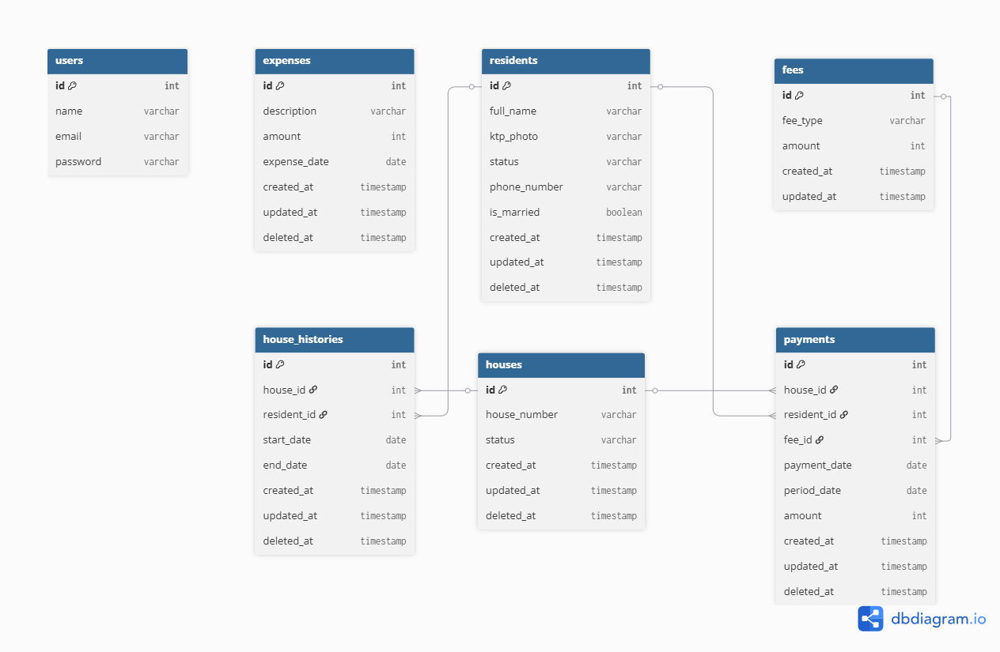
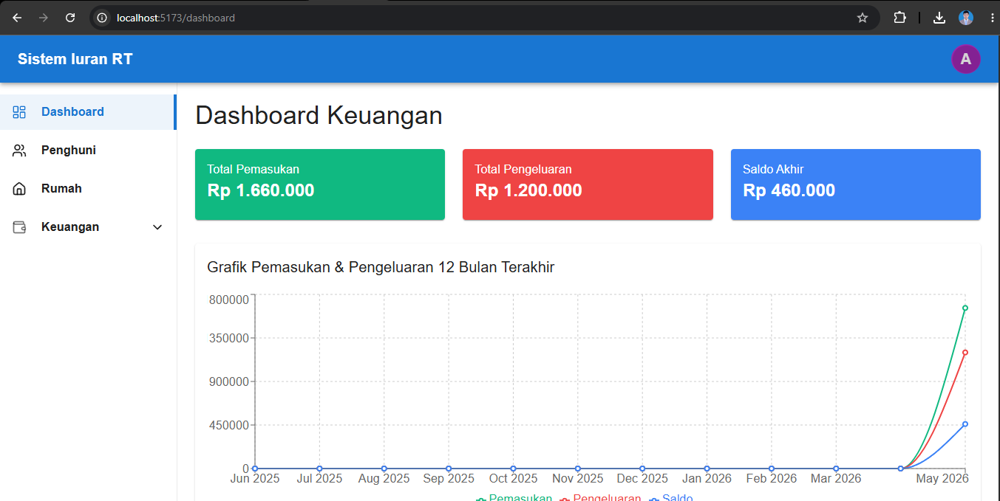
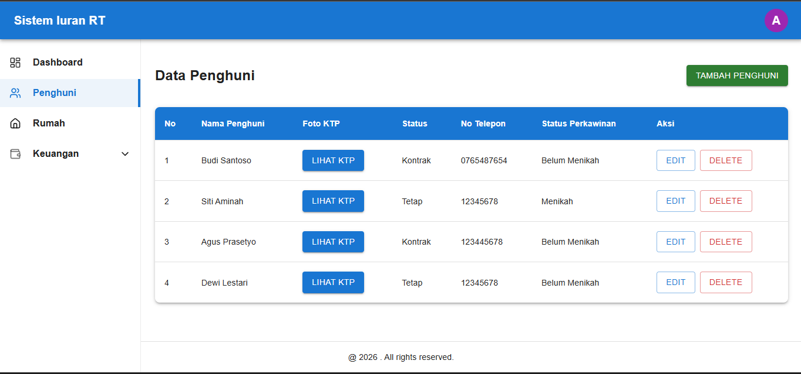
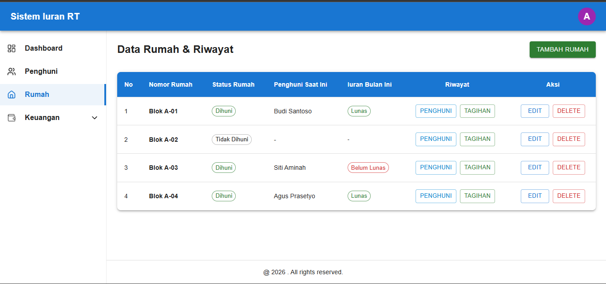
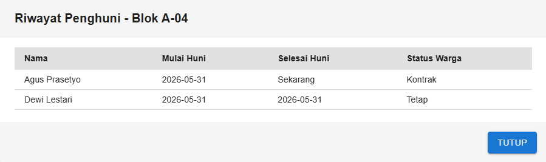
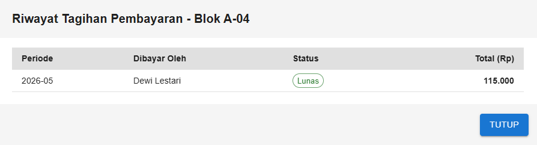
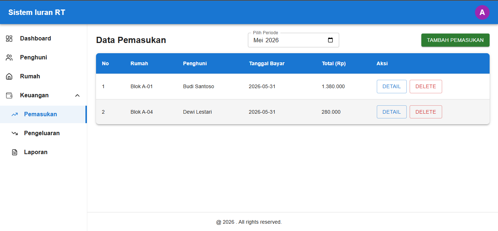
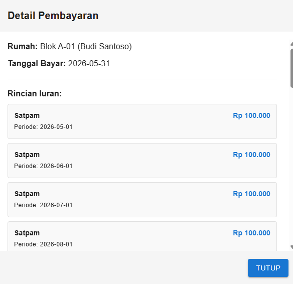
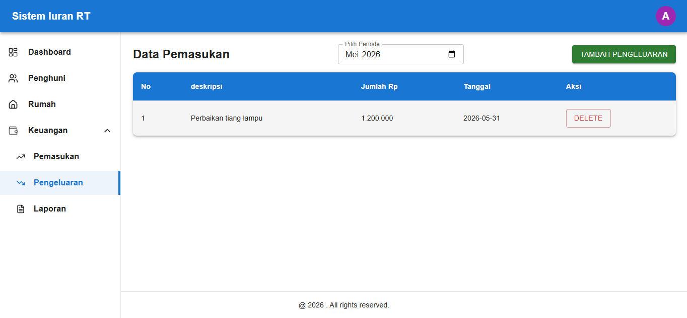
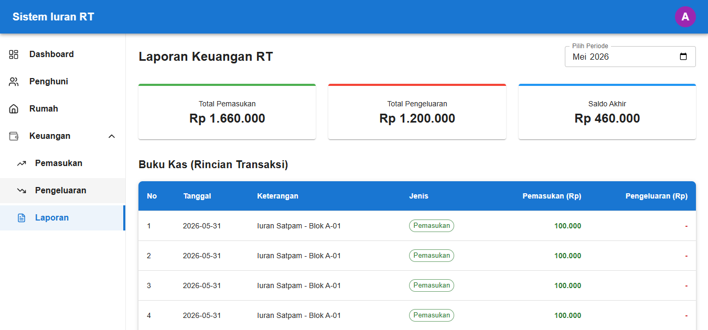

# RT Management System

Aplikasi administrasi RT untuk mengelola penghuni, rumah, pembayaran iuran, pengeluaran, dan laporan keuangan.

## Teknologi

### Backend
- Laravel
- MySQL
- REST API

### Frontend
- React
- React Router
- Axios
- Tailwind CSS

---

# Fitur

## Dashboard
- Ringkasan pemasukan
- Ringkasan pengeluaran
- Saldo akhir
- Grafik keuangan 12 bulan

## Manajemen Penghuni
- Tambah penghuni
- Edit penghuni
- Upload foto KTP
- Status penghuni (Tetap / Kontrak)
- Status pernikahan
- Nomor telepon

## Manajemen Rumah
- Tambah rumah
- Edit rumah
- Status rumah (Dihuni / Tidak Dihuni)
- Penempatan penghuni ke rumah
- Riwayat penghuni rumah

## Pembayaran
- Pembayaran iuran satpam
- Pembayaran iuran kebersihan
- Pembayaran bulanan
- Pembayaran beberapa bulan sekaligus
- Status lunas dan belum lunas

## Pengeluaran
- Tambah pengeluaran
- Edit pengeluaran
- Kategori pengeluaran
- Riwayat pengeluaran

## Laporan
- Laporan pemasukan bulanan
- Laporan pengeluaran bulanan
- Saldo bulanan
- Grafik keuangan selama 12 bulan

---

# ERD



---

# Struktur Project

```
project-root
│
├── backend
│   ├── app
│   ├── routes
│   ├── database
│   └── ...
│
├── frontend
│   ├── src
│   ├── public
│   └── ...
│
├── screenshots
│
├── ERD.png
│
└── README.md
```

---
# Clone Repository

```bash
git clone https://github.com/MaulanaJA92/rt-management-system.git

cd rt-management-system
```

---

# Requirements

- PHP 8.2+
- Composer
- Node.js 20+
- MySQL 8+

---

# Instalasi Backend

Masuk ke folder backend

```bash
cd backend
```

Install dependency

```bash
composer install
```

Copy file environment

```bash
cp .env.example .env
```

Generate application key

```bash
php artisan key:generate
```

Buat database MySQL

```sql
CREATE DATABASE rt_management;
```

Atur konfigurasi database pada file `.env`

```env
DB_CONNECTION=mysql
DB_HOST=127.0.0.1
DB_PORT=3306
DB_DATABASE=rt_management
DB_USERNAME=root
DB_PASSWORD=
```

Jalankan migration

```bash
php artisan migrate
```

Jalankan seeder

```bash
php artisan db:seed
```

Jalankan backend

```bash
php artisan serve
```

Backend berjalan pada:

```text
http://127.0.0.1:8000
```

---

# Instalasi Frontend

Masuk ke folder frontend

```bash
cd frontend
```

Install dependency

```bash
npm install
```

Jalankan frontend

```bash
npm run dev
```

Frontend berjalan pada:

```text
http://localhost:5173
```

Frontend sudah dikonfigurasi untuk mengakses backend pada:

```text
http://127.0.0.1:8000/api
```

---

# Akun Login

## Administrator

```text
Email    : admin@gmail.com
Password : password
```

---

# Screenshot Fitur

## Dashboard



## Daftar Penghuni



## Daftar Rumah






## Pembayaran




## Pengeluaran



## Laporan



---

# Catatan


- Database menggunakan MySQL.
- Aplikasi dijalankan pada local environment.
